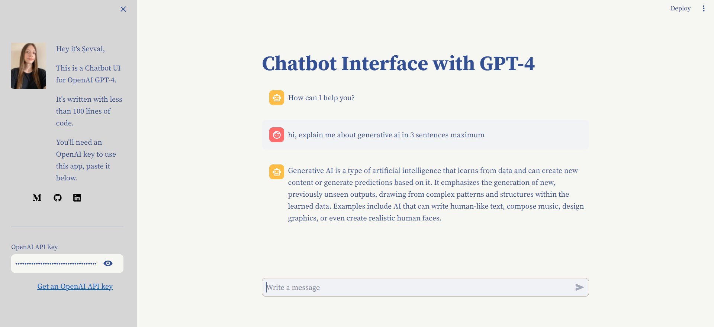

# Chatbot Interface with OpenAI GPT-4

## Overview

This project is a simple chat interface built using Streamlit and powered by the OpenAI GPT-4 model. It allows users to interact with a chatbot by entering messages and receiving responses generated by the OpenAI model.

<div align="center"></div>

## Getting Started

### Dependencies

This code uses the following libraries:

- `streamlit`: for building the user interface. 
- `openai`: for chat  
- OpenAI API key: Get it from [OpenAI platform](https://platform.openai.com/account/api-keys)


### Usage

Follow these steps to set up and run the project:

1. Create a virtual environment:
```
python3 -m venv my_env
source my_env/bin/activate 
.\my_env\Scripts\activate 
```

2. Install dependencies:
```
pip install -r requirements.txt
```

3. Run the Streamlit server:
```
streamlit run app.py
```

4. Access the application in your browser at http://localhost:8501.

5. Enter your OpenAI API key in the provided input field.

6. Start chatting with the assistant!

## Repository Structure
```
repository/
├── app.py # the code and UI integrated together live here
├── about.py # function adding gui elements
├── requirements.txt # the python packages needed to run locally
├── .streamlit/
│   └── config.toml # theme info for the UI
└── docs/
    └── preview.png # preview photo for Github
```

## How it Works

The app as follows:

1. The user enters a question in the input field.

2. User messages are sent to the OpenAI GPT-4 model for processing.

3. The user's input, along with the chat history, is used to generate a response.

4. The GPT-4 model generates a response based on the patterns it learned during training.

5. Users can continue the conversation by entering additional messages.